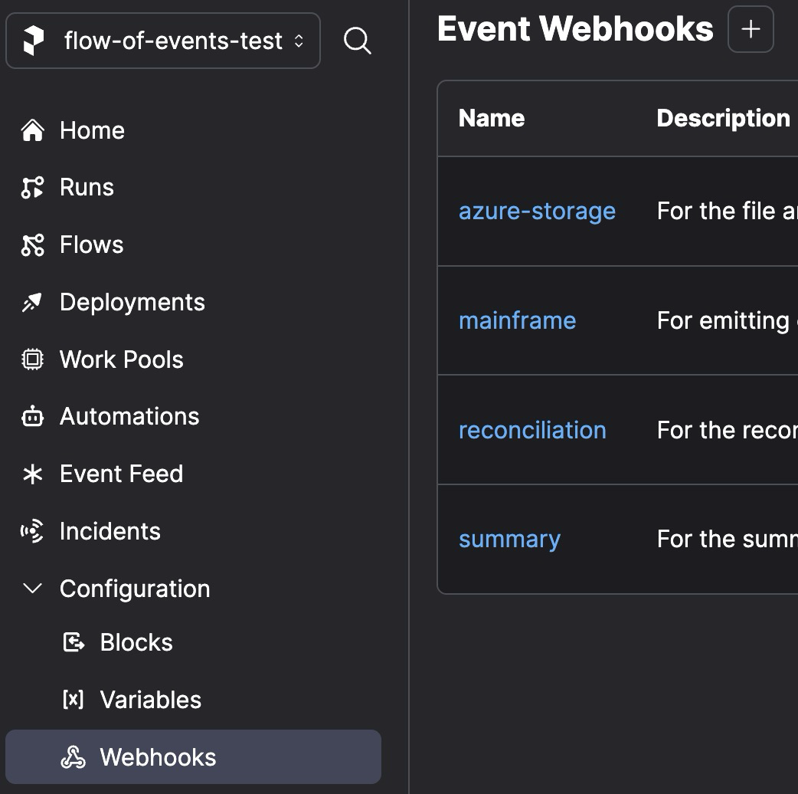

# The README

## Observing an external system with a legacy scheduler

To install Prefect, connect to Prefect Cloud, and learn the basics, [follow this quickstart](https://docs-3.prefect.io/3.0rc/get-started/quickstart#connect-to-prefects-api). Make sure you've been invited to at least one workspace by an admin.

## Create [Webhooks](https://docs-3.prefect.io/3.0rc/automate/events/webhook-triggers)

Prefect webhooks expose a unique [URL endpoint](https://docs-3.prefect.io/3.0rc/automate/events/webhook-triggers#webhook-endpoints) to receive events from other systems and transform them into Prefect events

The [template](https://docs-3.prefect.io/3.0rc/automate/events/webhook-triggers#webhook-templates) you define for each webhook determines how individual components of the incoming HTTP request become the event name and resource labels of the resulting Prefect event.

> **Tip:** Head to [`create_all_webhooks.sh`](create_all_webhooks.sh) to do this all in one go. Simply run the script by typing `bash create_all_webhooks.sh` in your terminal.

Let's create a series of webhooks with custom templates to represent the different zones of your stack.

For this example we'll create:

- **Mainframe** - For emitting events from the legacy scheduler side.
- **Azure Storage** - For the file arrived in Azure Blob storage event.
- **Summary Event** - For the summary event originating from the event emitter
- **Reconciliation Event** - For the reconciliation event originating from the event consumer

These can be created in the UI, but below you'll find the relevant CLI commands:

#### Mainframe Webhook from legacy scheduler Environment
```bash
prefect cloud webhook create mainframe \
    --description "For emitting events from the legacy scheduler/Mainframe side" \
    --template '{ "event": "{{ body.event_name }}", "resource": { "prefect.resource.id": "prefect.webhook.mainframe", "prefect.resource.name": "prefect.webhook.mainframe", "stage": "{{ body.stage }}", "file_name": "{{ body.file_name }}", "trackingId": "{{ body.trackingId }}" } }'
```
In this example, we specify two custom fields in our template: `stage` and `file_name`. This flexibility allows us to reuse the same webhook across multiple stages of the legacy scheduler side of the global workflow by adjusting the `stage` value in each payload. We also add a `trackingId` field to trace events from the legacy scheduler to their corresponding downstream events in Azure.

Go find this webhook in the Prefect UI by clicking `Configuration` then `Webhooks` in the left hand nav bar:

<div style="display: flex; align-items: flex-start;">
  
  
</div>


Test that this webhook works by running the following curl command, replacing the URL with your webhook's endpoint:
```bash
curl -X POST 'https://api.prefect.cloud/hooks/<REPLACE-ME>' -H "Content-Type: application/json" -d '{"event_name": "kickoff", "file_name": "example_file.csv", "stage": "on-prem"}'
```

On the left hand nav, click on `* Event Feed`, you should see events like:
 

^The creation event was consumed at webhook creation, the Kickoff event was consumed when you hit the webhook endpoint with the curl command.

Alright, now that we know our way around, here are the rest of the webhooks:

#### Azure File Arrived Webhook
```bash
prefect cloud webhook create azure-storage \
    --description "For the file arrived in Azure Blob storage event" \
    --template '{ "event": "{{body[0].eventType}}", "payload": { "topic": "{{body[0].topic}}", "subject": "{{body[0].subject}}", "eventType": "{{body[0].eventType}}", "eventTime": "{{body[0].eventTime}}", "id": "{{body[0].id}}", "data": { "api": "{{body[0].data.api}}", "clientRequestId": "{{body[0].data.clientRequestId}}", "requestId": "{{body[0].data.requestId}}", "eTag": "{{body[0].data.eTag}}", "contentType": "{{body[0].data.contentType}}", "contentLength": "{{body[0].data.contentLength}}", "blobType": "{{body[0].data.blobType}}", "url": "{{body[0].data.url}}", "sequencer": "{{body[0].data.sequencer}}", "storageDiagnostics": { "batchId": "{{body[0].data.storageDiagnostics.batchId}}" } }, "dataVersion": "", "metadataVersion": "1" }, "resource": { "prefect.resource.id": "{{ body[0].data.url }}", "url": "{{body[0].data.url}}" } }'
```

#### Summary Webhook from Azure Function

```bash
prefect cloud webhook create summary \
    --description "For the summary event originating from the event emitter" \
    --template '{ "event": "Summary", "resource": { "prefect.resource.id": "prefect.webhook.summary", "prefect.resource.name": "prefect.webhook.summary", "totalRecordsSent": "{{ body.totalRecordsSent }}", "trackingId": "{{ body.trackingId }}" } }'
```

#### Reconciliation Webhook from Java Event Transformation System
```bash
prefect cloud webhook create reconciliation \
    --description "For the reconciliation event originating from the event consumer" \
    --template '{ "event": "Reconciliation", "resource": { "prefect.resource.id": "prefect.webhook.reconciliation", "prefect.resource.name": "prefect.webhook.reconciliation", "totalRecordsReceived": "{{ body.totalRecordsReceived }}", "trackingId": "{{ body.trackingId }}" } }'
```
You should now see these webhooks in your workspace:


## Serve the Flow 

Run the following to serve the flow:
```bash
python flow.py
```

Run python `flow.py` to serve the flow resulting in a [deployment being created for the flow](https://docs-3.prefect.io/3.0rc/deploy/index). A deployment is required as we want this flow to run in an [event-driven fashion](https://docs-3.prefect.io/3.0rc/automate/events/automations-triggers#create-an-automation-with-deployment-triggers). Instead of, or in addition to, running this flow on a schedule, we can trigger it when an event is emitted indicating that a file is being processed (like an event indicating that the `mainframe` webhook got called) on the legacy scheduler side. A [deployment object](https://docs-3.prefect.io/3.0rc/deploy/index#deployment-schema) is required for this functionality.

For your reference:
```python
from prefect.events import DeploymentEventTrigger

    event_driven_flow.serve(
        name="Event Driven Flow", # Deployment name here
        triggers=[
            DeploymentEventTrigger( # Deployment trigger here
                name="Kickoff",
                match={
                    "prefect.resource.id": "prefect.webhook.mainframe",
                    "stage": "on-prem",
                },
                parameters={ # Passing data from event payload to flow parameters here
                    "file_name": "{{ event.resource.file_name }}",
                    "tracking_id": "{{ event.resource.trackingId }}",
                },
            )
        ],
    )
```

For deployments to run, a long running process that monitors for work from the Prefect API is required. This is automatically started when you `flow.serve()`.

> **Note on Deployments:** [Serving a flow](https://docs-3.prefect.io/3.0rc/deploy/run-flows-in-local-processes) is the fastest way to get started, though in practice, many enterprise users leverage the [`flow.deploy()`](https://docs-3.prefect.io/3.0rc/deploy/infrastructure-concepts/work-pools) method instead of `flow.serve()` to take advantage of [work pools](https://docs-3.prefect.io/3.0rc/deploy/infrastructure-concepts/work-pools) that provide [dynamically provisioned infrastructure](https://docs-3.prefect.io/3.0rc/deploy/index#dynamic-infrastructure). When you advance to using work pools, the long running process started by `flow.serve()` is replaced by a more generalizable [worker process](https://docs-3.prefect.io/3.0rc/deploy/infrastructure-concepts/workers).

## Simulate Events

Serving the flow starts a long-running process that listens for scheduled work. It doesn't actually _run_ the flow. The deployment we defined in the `flow.serve()` step above makes it so that the deployed flow will run when an event matching it's trigger arrives in the Prefect event feed. Lets simulate these events by using simple curl commands to hit our webhook endpoints using the files [`event_simulator_succeed.sh`](event_simulator_succeed.sh) or [`event_simulator_fail.sh`](event_simulator_fail.sh).

> **❗Important:** Its necessary to update the webhook URLs with the webhook URLs generated during the create webhook step. Look for the `<REPLACE-ME>` placeholders in the files.

```bash
bash event_simulator_fail.sh
```

```bash
bash event_simulator_succeed.sh
```

## Making this Real

[https://www.loom.com/share/e5ac0d32d3984836a0c55c84aa67a6b0?sid=6178b1c9-8877-472d-8090-901691a42c57](https://www.loom.com/share/e5ac0d32d3984836a0c55c84aa67a6b0?sid=6178b1c9-8877-472d-8090-901691a42c57)

